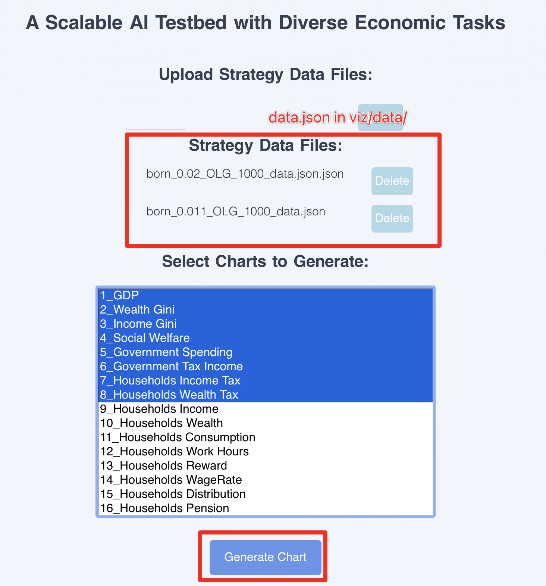
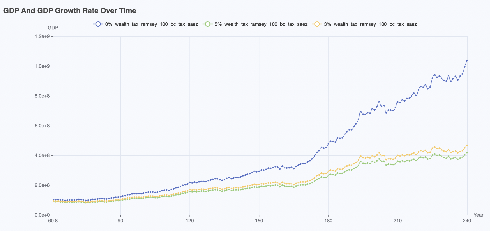
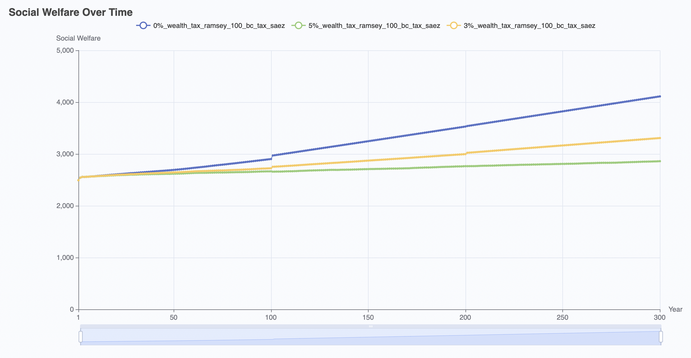
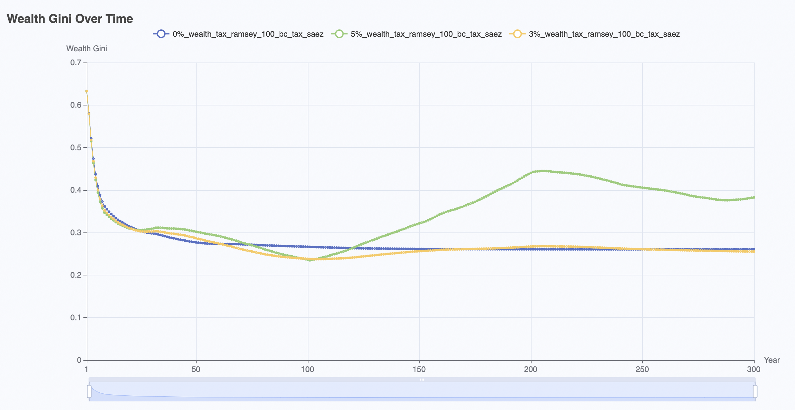

# 🌐 EconGym: A Scalable AI Testbed with Diverse Economic Tasks


**EconGym** is a modular and scalable simulation testbed designed for AI-driven economic analysis, policy optimization, and algorithm benchmarking. Built upon rigorous economic modeling, it supports **25+ benchmark tasks** involving heterogeneous agents—households, firms, banks, and governments—with structured observation, action, and reward interfaces.

Users can simulate multi-agent economic dynamics by flexibly combining economic roles and agent algorithms (e.g., rule-based, reinforcement learning, large language models), enabling reproducible research across disciplines.


**Paper**: [EconGym: A Scalable AI Testbed with Diverse Economic Tasks](https://arxiv.org/abs/2506.12110)

**Web Page**: [EconGym Official Page](https://miracle1207.github.io/econgym_page/)


---

## 📣 News

[09/26/2025] 🎉 The **EconGym** code is officially released! Dive into the platform and start simulating multi-agent economic dynamics!

[09/19/2025] 🎉 [**EconGym**](https://neurips.cc/virtual/2025/poster/121445) accepted for NeurIPS 2025!


---

## 📘 User Manual

We provide a detailed **User Manual** that covers **25 key economic research questions**, each accompanied by:

- An introduction to the economic issue  
- Recommended choices of economic roles and agent algorithms  
- Baseline experimental results and visualizations  
- A YAML configuration file for running the environment directly

🔗 See the [`document/`](document/) folder for full documentation and research use cases.

Below is an overview of the 25 economic benchmark problems and their corresponding YAML configuration files:

---

### 🏦 Pension Issues

| No.  | Research Question                                           | YAML File                       |
| ---- | ----------------------------------------------------------- | ------------------------------- |
| Q1   | [`How does delayed retirement affect the economy?`](document/Pension%20Issues/Q1-How-does-delayed-retirement-affect-the-economy.md) | `delayed_retirement.yaml`       |
| Q2   | [`Do personal pensions improve security?`](document/Pension%20Issues/Q2-Do-personal-pensions-improve-security.md) | `personal_pension.yaml`         |
| Q3   | [`How does aging impact the macroeconomy?`](document/Pension%20Issues/Q3-How-does-aging-impact-the-macroeconomy.md) | `population_aging.yaml`         |
| Q4   | [`How to close pension funding gaps?`](document/Pension%20Issues/Q4-How-to-close-pension-funding-gaps.md) | `pension_gap.yaml`              |
| Q5   | [`How do pension systems vary across countries?`](document/Pension%20Issues/Q5-How-do-pension-systems-vary-across-countries.md) | `pension_across_countries.yaml` |

### 💰 Fiscal Policy Issues

| No.  | Research Question                                            | YAML File                     |
| ---- | ------------------------------------------------------------ | ----------------------------- |
| Q1   | [`Can consumption taxes boost growth and fairness?`](document/Fiscal%20Policy%20Issues/Q1-Can-consumption-taxes-boost-growth-and-fairness.md) | `consumption_tax.yaml`        |
| Q2   | [`How does inheritance tax affect wealth distribution?`](document/Fiscal%20Policy%20Issues/Q2-How-do-inheritance-tax-affect-wealth-distribution.md) | `estate_tax.yaml`             |
| Q3   | [`Does universal basic income enhance equity?`](document/Fiscal%20Policy%20Issues/Q3-Does-universal-basic-income-enhance-equity.md) | `universal_basic_income.yaml` |
| Q4   | [`How to design optimal tax policies?`](document/Fiscal%20Policy%20Issues/Q4-How-to-design-optimal-tax-policies.md) | `optimal_tax.yaml`            |
| Q5   | [`How does wealth tax impact wealth concentration?`](document/Fiscal%20Policy%20Issues/Q5-How-do-wealth-tax-impact-wealth-concentration.md) | `wealth_tax.yaml`             |

### 🏛️ Monetary Policy Issues

| No.  | Research Question                                            | YAML File                |
| ---- | ------------------------------------------------------------ |--------------------------|
| Q1   | [`How effective are negative interest rates?`](document/Monetary%20Policy%20Issues/Q1-How-effective-are-negative-interest-rates.md) | `negative_interest.yaml` |
| Q2   | [`How to control inflation via monetary policy?`](document/Monetary%20Policy%20Issues/Q2-How-to-control-inflation-via-monetary-policy.md) | `inflation_control.yaml` |
| Q3   | [`What are the long-term effects of quantitative easing?`](document/Monetary%20Policy%20Issues/Q3-What-are-the-long-term-effects-of-quantitative-easing.md) | `QE.yaml`                |
| Q4   | [`How to set optimal bank rate spreads?`](document/Monetary%20Policy%20Issues/Q4-How-to-set-optimal-bank-rate-spreads.md) | `optimal_monetary.yaml`  |
| Q5   | [`How to coordinate monetary and fiscal policies?`](document/Monetary%20Policy%20Issues/Q5-How-to-coordinate-monetary-and-fiscal-policies.md) | `dbl_government.yaml`    |

### ⚖️ Market Competition Issues

| No.  | Research Question                                            | YAML File                       |
| ---- | ------------------------------------------------------------ |---------------------------------|
| Q1   | [`How does technology drive long-term growth?`](document/Market%20Competition%20Issues/Q1-How-does-technology-drive-long-term-growth.md) | `technology.yaml`               |
| Q2   | [`How do monopolies affect resources and welfare?`](document/Market%20Competition%20Issues/Q2-How-do-monopolies-affect-resources-and-welfare.md) | `monopoly.yaml`                 |
| Q3   | [`What is algorithmic collusion in oligopolies?`](document/Market%20Competition%20Issues/Q3-What-is-algorithmic-collusion-in-oligopolies.md) | `oligopoly.yaml`                |
| Q4   | [`How does product diversity affect welfare?`](document/Market%20Competition%20Issues/Q4-How-does-product-diversity-affect-welfare.md) | `monopolistic_competition.yaml` |

### 👤 Individual Decision-Making Issues

| No.  | Research Question                                            | YAML File                         |
| ---- | ------------------------------------------------------------ |-----------------------------------|
| Q1   | [`Does the “996” work culture improve utility and efficiency?`](document/Individual%20Decision%20Issues/Q1-Does-the-996-work-culture-improve-utility-and-efficiency.md) | `work_hard.yaml`                  |
| Q2   | [`How does age affect consumption patterns?`](document/Individual%20Decision%20Issues/Q2-How-does-age-affect-consumption-patterns.md) | `age_consumption.yaml`            |
| Q3   | [`How does asset allocation affect wealth?`](document/Individual%20Decision%20Issues/Q3-How-does-asset-allocation-affect-wealth.md) | `asset_allocation.yaml`           |
| Q4   | [`How does work-life balance impact well-being?`](document/Individual%20Decision%20Issues/Q4-How-does-work-life-balance-impact-well-being.md) | `work_life_well_being.yaml`       |
| Q5   | [`How does over-leveraged consumption impact the economy?`](document/Individual%20Decision%20Issues/Q5-How-does-over-leveraged-consumption-impact-the-economy.md) | `over_leveraged_consumption.yaml` |
| Q6   | [`How do market structures shape consumer behavior?`](document/Individual%20Decision%20Issues/Q6-How-do-market-structures-shape-consumer-behavior.md) | `market_type.yaml`                |

---

## 🔧 Installation

We recommend using `conda` for environment management.

1. **Create and activate a new Python environment**

   ```bash
   conda create -n EconGym python=3.10
   conda activate EconGym
   ```

2. **Install PyTorch**
    Refer to [https://pytorch.org](https://pytorch.org/) for installation instructions specific to your system.

3. **Clone the repository and install dependencies**

   ```bash
   cd EconGym
   pip install -r requirements.txt
   ```

4. **Install MPI support**

   ```bash
   conda install mpi4py
   ```


---

## 🚀 How to Run Simulations

You can either use **predefined economic tasks** (fast start), or **customize your own experiments** (advanced use).

### ✅ Option 1: Run Predefined Scenarios (Fast Start)

We provide ready-to-use YAML configurations under `cfg/`:

```bash
python main.py --problem_scene "optimal_monetary"
```

This command loads `cfg/optimal_monetary.yaml`, which specifies the simulation setup. Each `--problem_scene` matches a YAML file in `cfg/`. You can customize these YAMLs or create new ones for your own tasks.

💡 For the full list of predefined tasks and their YAML files, refer to the **User Manual** section above.

**Available options for `--problem_scene` include:**

```text
delayed_retirement
universal_basic_income
wealth_tax
market_type
personal_pension
```

To run multi-government coordination, set `--problem_scene` to one of the supported scenarios, such as:
```bash
python main.py --problem_scene "tre_government"
```
Available options include: "tre_government" and "dbl_government".


------

### 🧪 Option 2: Define Your Own Economic Scenario (Advanced Users)

Advanced users can fully customize the problem setup by modifying parameters in a YAML file. You may also create a new file named `"task_name.yaml"` under the `cfg/` directory and run:

```bash
python main.py --problem_scene "task_name"
```

The most important configurations in the YAML file are the **economic roles** and **agent algorithms**. Other parameters can be tailored to your needs and are explained in more detail in our paper.


#### 1. Configure Economic Roles in YAML

Each role is defined with a `type` field. For example:

```yaml
- entity_name: 'government'
  entity_args:
    params:
      type: "pension"

- entity_name: "households"
  entity_args:
    params:
      type: 'OLG'

- entity_name: 'market'
  entity_args:
    params:
      type: "perfect"

- entity_name: 'bank'
  entity_args:
    params:
      type: 'non_profit'
```

**Supported types:**

| Role       | Type Options                                                 |
| ---------- | ------------------------------------------------------------ |
| Household  | `ramsey`, `OLG`                                              |
| Government | `tax`, `pension`, `central_bank`                             |
| Market     | `perfect`, `monopoly`, `oligopoly`, `monopolistic_competition` |
| Bank       | `non_profit`, `commercial`                                   |

#### 2. Select Agent Algorithms

EconGym supports:

- `rule_based` – Hardcoded expert rules (e.g., IMF policy)
- `data_based` – Real policy data (e.g., U.S. retirement age = 67)
- `bc` – Behavior cloning
- `ddpg`, `ppo` – Reinforcement learning
- `llm` – Large language models

Example in YAML:

```yaml
Trainer:
  house_alg: "bc"
  gov_alg: "llm"
  firm_alg: "rule_based"
  bank_alg: "ddpg"
```

You can define your own algorithm in `agents/`.

------


## 📊 Analysis and Visualization

After each simulation, EconGym will store time-series interaction data in `viz/data/`.

### 🔢 Metrics and Evaluation Logic

All evaluation metrics are defined in `runner.py`. In particular:

- `self.init_economic_dict()`: Specifies which economic indicators are initialized and tracked.
- `self._evaluate_agent()`: Uses the `eval_econ` list to determine which variables are saved for visualization and analysis.

Users can freely customize this by modifying `runner.py` to track additional variables.

**Default tracked metrics include:**

```python
eval_econ = ["gov_reward", "house_reward", "social_welfare", "per_gdp", "income_gini",
 "wealth_gini", "years", "GDP", "gov_spending", "house_total_tax",
 "house_income_tax", "house_wealth_tax", "house_wealth", "house_income",
 "house_consumption", "house_pension", "house_work_hours", "total_labor",
 "WageRate", "house_age"]
```

### 📈 Visualization Interface

EconGym includes an interactive dashboard powered by Flask, allowing users to visualize economic metrics over time.

#### 🧭 Step 1: Launch the interface

Run the following command:

```bash
python viz_index.py
```

This will start a local web server.

#### 🌐 Step 2: Open the visualization dashboard

Visit the following address in your browser:

[http://127.0.0.1:5000](http://127.0.0.1:5000)

You will see an interface like this:



#### 📊 Step 3: Select and generate charts

* Choose the metric you want to visualize.
* Click **"Generate Chart"** to render the chart.

You’ll see dynamic visualizations similar to the examples below:

---

### 🎥 Dynamic Visualizations

1. **Wealth distribution over time**
   Households under the **Ramsey model**
   

2. **Consumption distribution over time**
   Households under the **Ramsey model**
   

3. **Age-specific consumption over time**
   Individuals under the **OLG model**, with age-heterogeneous behavior
   

4. **Pension flow over time**
   Under the **OLG model**:

   * Positive values indicate receiving pensions
   * Negative values indicate contributing to pension insurance
     

---

### 📈 Time-Series Plots

5. **GDP over time**
   

6. **Social welfare trajectory**
   

7. **Wealth Gini index over time**
   


------

## 📁 Repository Structure

```text
EconGym/
├── README.md               # Project introduction and instructions
├── requirements.txt        # Python dependencies

# 🔧 Configuration and Scenario Definitions
├── cfg/                    # YAML configs for 25+ economic benchmark tasks
│   ├── *.yaml              # Each defines a full scenario setup (e.g., tax models, pension models)
│   ├── calibrate*.py       # Scripts for calibrating reward functions and parameters

# 🧠 Agents and Algorithms
├── agents/                 # Implementation of agent types
│   ├── __init__.py         # Initialization file for the agents module
│   ├── behavior_cloning/   # Behavioral cloning agents (learning from demonstrations)
│   │   ├── __init__.py     # Initialization file for behavior cloning agents
│   │   ├── bc_agent.py     # Main file for behavior cloning agents
│   │   └── trained_models  # Directory for storing trained models
│   ├── data/               # Datasets and resources for agents
│   │   └── advanced_scfp2022_1110.csv  # Example dataset for training
│   ├── data_based_agent.py # Data-based agent trained on real-world data
│   ├── llm/                # Large Language Model (LLM) agent interface
│   │   ├── llm_agent.py    # LLM agent main file
│   │   └── prompts.py      # Prompt templates for LLMs
│   ├── log_path.py         # File for managing log paths and logging configuration
│   ├── models/             # Directory for storing generated trajectory data
│   ├── rl/                 # Reinforcement Learning (RL) agents
│   │   ├── __init__.py     # Initialization for RL agents
│   │   ├── ddpg_agent.py   # DDPG agent
│   │   ├── models.py       # Shared neural network architectures for RL agents
│   │   ├── ppo_agent.py    # PPO agent
│   │   └── sac_agent.py    # SAC agent
│   ├── rule_based/         # Rule-based agents
│   │   ├── __init__.py     # Initialization file for rule-based agents
│   │   ├── bank.py         # Bank logic (non-profit/commercial)
│   │   ├── government.py   # Government policy
│   │   ├── households.py   # Household behavior and decision-making
│   │   ├── market.py       # Market interaction logic (monopoly, perfect competition ...)
│   │   └── rules_core.py   # Core logic for rule-based systems
│   ├── saez.py             # Fiscal policy based on Saez Tax model
│   └── utils.py            # General utility functions for agents

# 🧩 Economic Entities and Logic
├── entities/               # Core economic actors in the system
│   ├── __init__.py         # Initialization file for entities module
│   ├── bank.py             # Private bank logic (including non-profit and commercial types)
│   ├── base.py             # Base class for all entities (inheritance)
│   ├── government.py       # Fiscal government logic (tax collection, etc.)
│   ├── households.py       # Household behavior (savings, consumption, etc.)
│   └── market.py           # Firm interactions in market (wage and price setting)

# 🌍 Simulation Environment
├── env/                    # Environment engine and evaluation logic
│   ├── __init__.py         # Initialization for environment module
│   ├── env_core.py         # Core logic for Markov game environment
│   └── set_observation.py  # Observation setup for all agents (state space)

# 🏃 Execution Scripts
├── main.py                 # Entry point for running the simulation (YAML-based configuration)
├── runner.py               # Controller for running experiments and training loops
├── arguments.py            # Command-line argument management for running scripts

# 📊 Visualization and Post-analysis
├── indicator.py            # Generate performance metrics and export them (e.g., to Excel)
├── viz/                    # Data visualization (Flask + charts)
│   ├── chart.py            # Logic for generating plots and charts
│   ├── templates/          # HTML templates for visualization (Flask dashboard)
│   ├── data/               # Directory for storing visualized data
│   ├── models/             # Saved models used for visualization
│   └── viz_index.py        # Flask app for interactive visualization of simulation results

# 🌐 Static Assets for Web Interface
├── static/                 # Web frontend resources (CSS, JS, Images)
│   ├── css/                # Stylesheets for web UI
│   ├── js/                 # JavaScript files for web UI interactivity
│   └── img/                # Image files for UI elements (e.g., icons)

# ⚙️ Utilities
├── utils/                  # General-purpose utility functions and modules
│   ├── config.py           # Functionality to load and manage configuration files
│   ├── episode.py          # Episode buffer and management logic
│   ├── experience_replay.py# Replay buffer for training reinforcement learning agents
│   ├── normalizer.py       # Data normalization (scaling and transformations)
│   └── seeds.py            # Management of random seeds for reproducibility

```

## Citation and Acknowledgments

We would like to express our sincere gratitude to [Prof. Bo Li](https://liboecon.com/) from Peking University for his invaluable discussions and feedback throughout the development of this project. As a distinguished economist, Prof. Li provided critical insights into the theoretical foundations of the economic models in EconGym, significantly enhancing the platform’s rigor and realism.

If you use `EconGym` in your research or projects, we kindly ask you to cite the following:

```bibtex
@inproceedings{mi2025econgym,
  title={EconGym: A Scalable AI Testbed with Diverse Economic Tasks},
  author={Qirui Mi and Qipeng Yang and Zijun Fan and Wentian Fan and Heyang Ma and Chengdong Ma and Siyu Xia and Bo An and Jun Wang and Haifeng Zhang},
  journal={Advances in Neural Information Processing Systems},
  year={2025},
}
```

