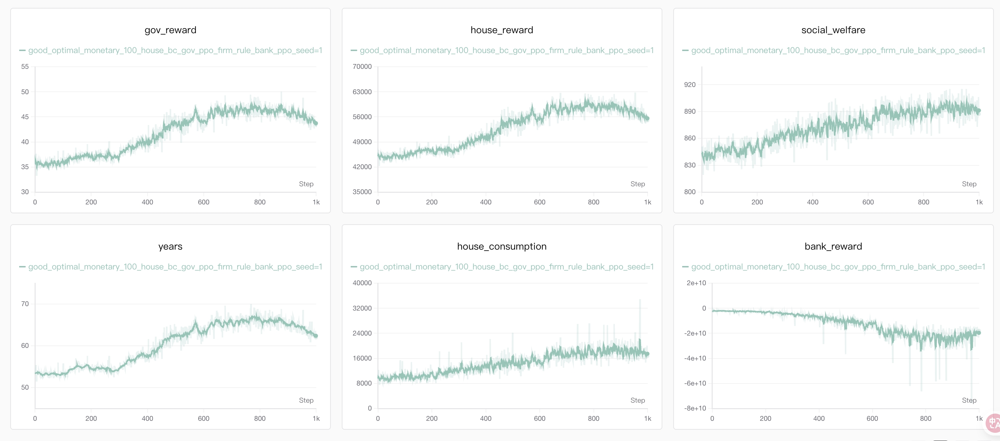

# Q4: How to set optimal bank rate spreads?

## 1. Introduction

### 1.1 Net Interest Margin of Commercial Banks

**Net Interest Margin​**​​ (​**NIM**) is the difference between the average interest rate a commercial bank earns on loans and the average rate it pays to depositors. It constitutes one of the bank’s core profit sources. According to data from the **Bank for International Settlements**​​ (​BIS) and the People’s Bank of China, China’s large commercial banks have recorded an average NIM of approximately 1.8%–2.2% in recent years, whereas U.S. banks’ margins have averaged around 2.5%–3.0%. During periods of monetary easing or abundant liquidity, banks often face margin compression, which can dampen their lending incentives and threaten financial stability.

### 1.2 Impact of NIM on the Macroeconomy and Micro Agents

NIM influences both banks’ willingness to lend and firms’ and households’ ability to afford financing costs. Excessively wide margins may suppress investment and consumption, while overly narrow margins can undermine bank profitability and increase financial risk. At the micro level, NIM shapes spending decisions of households and firms; at the macro level, it affects credit expansion, employment, tax revenues, and wealth distribution.

### 1.3 Research Questions

This study uses a multi-agent economic simulation platform where commercial banks act as financial intermediaries adjusting lending behavior according to specified NIM settings. We focus on:

* **Government tax revenue:** How does NIM affect lending activity, corporate profits, consumption, and the size of the tax base?
* **GDP**​**​ ​**​​**Effect:** Do high margins constrain investment and consumption, reducing aggregate demand and output, while low margins impair banks’ capacity to extend credit?
* **Income ​**​​**Gap:** How does NIM influence financing accessibility, with high margins potentially creating barriers for low- and middle-income households and exacerbating income disparities?

### 1.4 Research Significance

* **Benchmarking Bank Behavior:**  By simulating credit expansion capacity, profitability, and social feedback under different NIM regimes, the study provides quantitative guidance for banks’ rate-setting and risk assessment.
* **Simulation-Based Evaluation of Interest-Rate Liberalization:**  As interest rates become more market-determined, understanding how margin fluctuations impact the broader economy can help regulators design more flexible monetary policy and financial supervision strategies.

---

## 2. Selected Economic Roles

As an example, we selected the following roles from the social role classification of the economic simulation platform. These roles align with the core understanding of the issue and are convenient to implement from an experimental perspective:

| Social Role | Selected Type        | Role Description                                                                                                             | Observation                                                                                                  | Action                                                             | Reward                         |
| ----------- | -------------------- | --------------------------------------------------------------------------------------------------------------------------- | ------------------------------------------------------------------------------------------------------------ | ------------------------------------------------------------------ | ------------------------------ |
| **Individual**  | Ramsey Model         | Ramsey agents are infinitely-lived households facing idiosyncratic income shocks and incomplete markets.                     | $o_t^i = (a_t^i, e_t^i)$<br>Private: assets, education<br>Global: wealth distribution, education distribution, wage rate, price_level, lending rate, deposit_rate | $a_t^i = (\alpha_t^i, \lambda_t^i, \theta_t^i)$<br>Asset allocation, labor, investment | $r_t^i = U(c_t^i, h_t^i)$ (CRRA utility)                     |
| **Government**  | Central Bank         | Central Bank adjusts nominal interest rates and reserve requirements, transmitting monetary policy to households and firms. |\$\$o\_t^g = (\\mathcal{A}\_{t}, \\mathcal{E}\_{t-1}, W\_{t-1}, P\_{t-1}, r^{l}\_{t-1}, r^{d}\_{t-1}, \\pi\_{t-1}, g\_{t-1})\$\$ <br>Wealth distribution, education distribution, wage rate, price level, lending rate, deposit_rate, inflation rate, growth rate. | $a_t^{\text{cb}} = ( \phi_t, \iota_t )$<br>Reserve ratio, benchmark rate | Inflation/GDP stabilization                                  |
| **Firm**       | Perfect Competition  | Perfectly Competitive Firms are price takers with no strategic behavior, ideal for baseline analyses.                       | /                                                                                                            | /                                                                | Zero (long-run)                |
| **Bank**       | Commercial Bank     | Commercial Bank strategically set deposit and lending rates to maximize profits, subject to central bank constraints.       | $o_t^{\text{bank}} = ( \iota_t, \phi_t, r^l_{t-1}, r^d_{t-1}, loan, F_{t-1} )$<br>Benchmark rate, reserve ratio, last lending rate, last deposit_rate, loans, pension fund. | $a_t^{\text{bank}} = ( r^d_t, r^l_t )$<br>Deposit, lending decisions | $r = r^l_t (K_{t+1} + B_{t+1}) - r^d_t A_{t+1}$<br>Interest margin |

---

### Rationale for Selected Roles

**Individual → Ramsey Model**  
The Ramsey model simulates households’ optimal consumption and saving decisions under different net interest margins.
When loan rates are high, low-income groups face greater borrowing constraints, affecting their welfare and intertemporal resource allocation—making this model ideal for capturing the micro-level distributional effects of margin changes.

**Government → Central Bank**  
Represented by the central bank, the government sets policy rates (e.g., refinancing rate, reserve requirement rate) that form the basis for commercial-bank rate-setting.
Although the central bank does not directly control net interest margins, it indirectly guides them through its monetary-policy framework, serving as the starting point and benchmark for margin regulation.

**Firm → Perfect Competition**  
In a perfectly competitive market, firms make production and hiring decisions based on price signals and financing costs.
Changes in net interest margins affect loan rates, which directly influence firms’ marginal cost of capital, thereby determining output, employment, and price dynamics.

**Bank → Commercial Bank**  
Commercial bank must balance profit maximization with risk control.
Their behavior shapes the pace of credit supply, households’ financing costs, and firms’ investment efficiency, making them the core of the margin transmission mechanism.

---

## 3. Selected Agent Algorithms

This section provides a recommended agent configuration. Users are encouraged to adjust agent types based on the specific needs of their experiments.

| Economic Role | Agent Algorithm        | Description                                                  |
| ------------- | ---------------------- | ------------------------------------------------------------ |
| Individual             | Behavior Cloning Agent | Replicate sensitivity differences of various income groups to interest-rate changes, reflecting realistic saving and consumption behaviors.  |
| Government             | RL Agent       | Train the optimal policy rules to control the permissible range of interest-margin fluctuations.                                       |
| Firm                 | Rule-Based Agent       | Simulate firms’ direct responses to changes in financing costs, consistent with the perfect-competition assumption.                         |
| Bank  | RL Agent| Learns through PPO algorithm to optimize long-term cumulative rewards. Well-suited for solving dynamic decision-making problems. |

---

## 4. Running the Experiment

### 4.1 Quick Start

To run the simulation with a specific problem scene, use the following command:

```bash
python main.py --problem_scene "optimal_monetary"
```

This command loads the configuration file `cfg/optimal_monetary.yaml`, which defines the setup for the "optimal_monetary" problem scene. Each problem scene is associated with a YAML file located in the `cfg/` directory. You can modify these YAML files or create your own to define custom tasks.

### 4.2 Problem Scene Configuration

Each simulation scene has its own parameter file that describes how it differs from the base configuration (`cfg/base_config.yaml`). Given that EconGym contains a vast number of parameters, the scene-specific YAML files only highlight the differences compared to the base configuration. For a complete description of each parameter, please refer to the comments in `cfg/base_config.yaml`.

### Example YAML Configuration: `optimal_monetary.yaml`

```yaml
Environment:
  env_core:
    problem_scene: "optimal_monetary"
    episode_length: 300
  Entities:
    - entity_name: 'government'
      entity_args:
        params:
          type: "central_bank"  # Focus on pension policy. type_list: ['tax', 'pension', 'central_bank']

    - entity_name: 'households'
      entity_args:
        params:
          type: 'ramsey'
          type_list: ['ramsey', 'OLG', 'OLG_risk_invest', 'ramsey_risk_invest']
          households_n: 100
          action_dim: 2


    - entity_name: 'market'
      entity_args:
        params:
          type: "perfect"   #  type_list: [ 'perfect', 'monopoly', 'monopolistic_competition', 'oligopoly' ]
          alpha: 0.25
          Z: 10.0
          sigma_z: 0.0038
          epsilon: 0.5

    - entity_name: 'bank'
      entity_args:
        params:
          type: 'commercial'   # [ 'non_profit', 'commercial' ]
          n: 1
          lending_rate: 0.0345
          deposit_rate: 0.0345
          reserve_ratio: 0.1
          base_interest_rate: 0.0345
          depreciation_rate: 0.06
          real_action_max: [ 1.0, 0.20 ]
          real_action_min: [ 0.0, -1e-3 ]

Trainer:
  house_alg: "bc"
  gov_alg: "ppo"
  firm_alg: "rule_based"
  bank_alg: "ppo"
  seed: 1
  epoch_length: 300
  cuda: False
#  n_epochs: 1000
  wandb: True
```
---

## **​5.​**​**Illustrative Experiment**

### Experiment 1: Training Curves

* **Experiment Description**:

  The training curves were obtained based on the parameters outlined above.

* **Baselines:**

 Below, we provide explanations of the experimental settings corresponding to each line in the visualization to help readers better understand the results.

  * **good\_optimal\_monetary\_100\_house\_bc\_gov\_ppo\_firm\_rule\_bank\_ppo\_seed=1 (green line):** Households are modeled as **Behavior-cloning agents** under the **Ramsey model** with 100 households; the government and the bank are **PPO agents**, and the firm is a **Rule-based agent**.

* **Visualized Experimental Results：**



**Figure 1:** Training curves (1k steps) under the commercial-banking setting (100 behavior-cloning households; PPO government & bank; rule-based firm). Household reward, consumption, social welfare, and years rise steadily (with a slight late-stage pullback), gov_reward improves mildly, while bank_reward trends negative as the bank compresses its net-interest margin to sustain credit supply. Solid lines show means; shaded regions denote variability.

* Under the current configuration, the bank sacrifices its own returns to sustain gains in household utility, consumption, and social welfare, thereby significantly extending years.

* The rise in welfare and consumption indicates effective policy learning; however, the negative bank_reward signals a need to rebalance objectives between financial stability and social goals.


### Experiment 2: Impact of Net Interest Margin on the Real Economy

* **Experiment Description:**

  Simulate commercial banks autonomously adjusting their net interest margin according to preset rules (e.g., a 1.5% reduction) and compare against a baseline scenario to observe how changes in market interest rates affect core economic indicators.
* **Experimental Variables:**
  
  * Commercial banks’ net interest margin (baseline margin vs. margin reduced by 1.5%)
  * Government tax revenue
  * Aggregate GDP level
  * Income and wealth inequality
* **Baselines:**
  
  Below, we provide explanations of the experimental settings corresponding to each line in the visualization to help readers better understand the results.
  
  * **bc\_rule\_based\_100\_ramsey (green line):** Households are modeled as **Behavior Cloning Agents** under the **Ramsey model ​**with ​**100 households**​, while the government is a ​**Rule-Based Agent**​.
  * **bc\_rule\_based\_100\_ramsey\_int\_margin\_0.015 (yellow line):** Households are modeled as **Behavior Cloning Agents** under the **Ramsey model ​**with ​**100 households**​, while the government is a ​**Rule-Based Agent**​,with reduces the ​**lending–deposit interest-rate margin to 0.015**​.
* **Visualized Experimental Results：**


**Figure 2 & Figure 3:** When commercial banks proactively lower their net interest margin, GDP growth is stimulated in both the short run and the medium-to-long run.

* Proactive NIM reductions by banks help boost aggregate economic output and modestly reduce income and wealth disparities.


