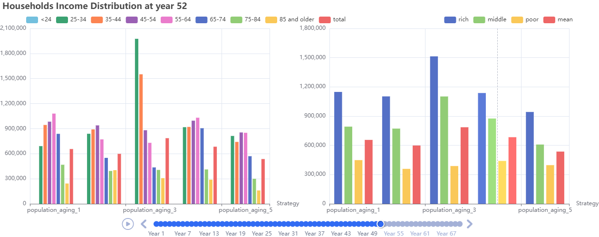

# Q3: How does aging impact the macroeconomy?

## 1. Introduction

### 1.1 Definition and Drivers of Population Aging

Population aging refers to the rising share of elderly individuals (typically those aged 65 and above) within a society’s total population. Conventionally, when the elderly population exceeds 7%, a society is classified as “aging”; when it surpasses 14%, it enters the stage of “deep aging.”

The primary drivers of population aging are:

* **Declining fertility:** Economic development, higher female education, and rising childrearing costs lead to lower birth rates and a shrinking young cohort.
* **Increased life expectancy:** Improvements in healthcare and living standards raise average lifespan, expanding the elderly population.
* **Cohort effects:** Large birth cohorts from past high-fertility periods gradually age into the elderly bracket, boosting the proportion of seniors.

### 1.2 Research Questions

Using an economic-simulation platform, this study examines the effects of population aging on national economies, specifically:

* **Capital Formation and ​GDP:** How does population aging affect aggregate savings, and long term GDP growth?
* **Social Equality:** What is the impact of population aging on intergenerational wealth distribution and inequality?
* **Household Behavior:** How do consumption and savings behaviors evolve across different age cohorts in aging societies?
  
### 1.3 Research Significance

* **Informing labor-market reform and delayed-retirement policies:**  Simulating labor-supply and demand dynamics under aging supports the design of scientifically grounded retirement ages and participation incentives.
* **Guiding long-term fiscal policy optimization:**  Understanding how demographic shifts affect public finances aids in crafting sustainable pension and social-protection systems.

---

## 2. Selected Economic Roles

As an example, we selected the following roles from the social role classification of the economic simulation platform. These roles align with the core understanding of the issue and are convenient to implement from an experimental perspective:

| Social Role | Selected Type       | Role Description                                                                                                       | Observation                                                                                                                                          | Action                                                       | Reward                                               |
| ----------- | ------------------- | --------------------------------------------------------------------------------------------------------------------- | ---------------------------------------------------------------------------------------------------------------------------------------------------- | ------------------------------------------------------------ | ---------------------------------------------------- |
| **Individual**  | OLG Model           | OLG agents are age-specific and capture lifecycle dynamics between working-age (Young) and retired (Old) individuals.  | $o_t^i = (a_t^i, e_t^i,\text{age}_t^i)$<br/>Private: assets, education, age<br/>Global: wealth distribution, education distribution, wage rate, price_level, lending rate, deposit_rate | $a_t^i = (\alpha_t^i, \lambda_t^i, \theta_t^i)$<br>Asset allocation, labor, investment <br/>*OLG*: old agents $\lambda_t^i = 0$    | $r_t^i = U(c_t^i, h_t^i)$ (CRRA utility)   <br/>*OLG includes pension if retired*      |
| **Government**  | Pension Authority   | Pension Authority manages intergenerational transfers by setting retirement age, contribution rates, and pension payouts.  | \$\$o\_t^g = ( F\_{t-1}, N\_{t}, N^{old}\_{t}, \\text{age}^r\_{t-1}, \\tau^p\_{t-1}, B\_{t-1}, Y\_{t-1}) \$\$ <br>Pension fund, current population, old individuals number, last retirement age, last contribution rate, debt, GDP | $a_t^{\text{pension}} = ( \text{age}^r_t, \tau^p_t, k )$<br>Retirement age, contribution rate, growth rate | Pension fund sustainability                                  |
| **Firm**       | Perfect Competition | Perfectly Competitive Firms are price takers with no strategic behavior, ideal for baseline analyses.                 | /                                                                                                                                                    | /                                                            | Zero (long-run)                                      |
| **Bank**       | Non-Profit Platform | Non-Profit Platforms apply a uniform interest rate to deposits and loans, eliminating arbitrage and profit motives.   | /                                                                                                                                                    | No rate control                                              | No profit                                            |


---

### Rationale for Selected Roles

**Individual → Overlapping Generations (OLG) Model**  
To capture heterogeneity in consumption, saving, and labor-supply across age cohorts, we employ the Overlapping Generations (OLG) framework. The OLG model naturally represents intergenerational wealth transfers, demographic shifts, and life-cycle behaviors.

**Government → Pension Authority**  
Facing rising pension expenditures and a shrinking tax base, the government’s Pension Department is directly responsible for formulating and adjusting policies related to population aging.

**Firm → Perfectly Competition**  
Wages in a perfectly competitive market are set by supply and demand, accurately reflecting price-mechanism adjustments in labor supply driven by demographic aging.

**Bank → Non-Profit Platform**  
We simulate long-run capital-market structures—investment and return mechanisms—under demographic change. Since this experiment focuses on structural shifts rather than short-term credit behavior, we use a no-arbitrage intermediary rather than a commercial-bank role.

---

## 3. Selected Agent Algorithms

This section provides a recommended agent configuration. Users are encouraged to adjust agent types based on the specific needs of their experiments.

| Economic Role | Agent Algorithm        | Description                                                  |
| ------------- | ---------------------- | ------------------------------------------------------------ |
| Individual             | Behavior Cloning Agent | Replicate sensitivity differences of various income groups to interest-rate changes, reflecting realistic saving and consumption behaviors.  |
| Government             | Rule-Based Agent       | Set benchmark rates and policy rules to control the permissible range of interest-margin fluctuations.                                       |
| Firm                 | Rule-Based Agent       | Simulate firms’ direct responses to changes in financing costs, consistent with the perfect-competition assumption.                         |
| Bank | Rule-Based Agent       | Commercial banks set margins according to preset strategies, facilitating the assessment of systemic effects under different margin regimes. |

---

## 4. Running the Experiment

### 4.1 Quick Start

To run the simulation with a specific problem scene, use the following command:

```bash
python main.py --problem_scene "population_aging"
```

This command loads the configuration file `cfg/population_aging.yaml`, which defines the setup for the "population_aging" problem scene. Each problem scene is associated with a YAML file located in the `cfg/` directory. You can modify these YAML files or create your own to define custom tasks.

### 4.2 Problem Scene Configuration

Each simulation scene has its own parameter file that describes how it differs from the base configuration (`cfg/base_config.yaml`). Given that EconGym contains a vast number of parameters, the scene-specific YAML files only highlight the differences compared to the base configuration. For a complete description of each parameter, please refer to the comments in `cfg/base_config.yaml`.

### Example YAML Configuration: `population_aging.yaml`

```yaml
Environment:
  env_core:
    problem_scene: "population_aging"
    episode_length: 300
  Entities:
    - entity_name: 'government'
      entity_args:
        params:
          type: "pension"
    - entity_name: 'households'
      entity_args:
        params:
          type: 'OLG'
          households_n: 1000
          action_dim: 2

        OLG:
          birth_rate: 0.011
          initial_working_age: 24
    - entity_name: 'market'
      entity_args:
        params:
          type: "perfect"
          sigma_z: 0.0038
          epsilon: 0.5

    - entity_name: 'bank'
      entity_args:
        params:
          type: 'non_profit'
          n: 1
          lending_rate: 0.0345
          deposit_rate: 0.0345
          reserve_ratio: 0.1
          base_interest_rate: 0.0345
          depreciation_rate: 0.06

Trainer:
  house_alg: "bc"
  gov_alg: "rule_based"
  firm_alg: "rule_based"
  bank_alg: "rule_based"
  seed: 1
  epoch_length: 300
  cuda: False
#  n_epochs: 300
```

---

## **​5.​**​**Illustrative Experiments**


### Experiment 1: Impact of Population Aging on Individual Wealth and Labor Supply

* **Experiment Description:**

  Compare household-level micro indicators across simulated economies with varying degrees of population aging, in order to assess both the direction and magnitude of aging’s impact on households.

* **Experimental Variables:**
  
  * Elderly population share (or demographic parameters)
  * Household income and consumption stratified by age and wealth
    
* **Baselines:**
  
  We constructed the simulated economic environment using **Individuals** modeled as **Behavior Cloning Agents** and ​**the Government** modeled as a **Rule-Based Agent**​. The bar charts illustrate household income distributions under different population aging scenarios:
  
  * **Population aging settings (groups of bars):**
    * **population\_aging\_1 :** Medium birth rate / High death rate
    * **population\_aging\_2 :** Medium birth rate / Medium death rate
    * **population\_aging\_3 :** High birth rate / Medium death rate
    * **population\_aging\_4 :** Medium birth rate / Low death rate
    * **population\_aging\_5 :** High birth rate / Low death rate
  * **Color coding (within each group):**
    * **Left panel:** Different bar colors represent **age cohorts** (e.g., <24, 25–34, 35–44, 45–54, 55–64, 65–74, 75–84, 85+, total).
    * **Right panel:** Different bar colors represent **income classes** (rich, middle, poor, and mean).
* **​ Visualized Experimental Results：**



**Figure 1:**​​**Household income statistics at Year 52 under different aging scenarios**​.From the age perspective, young individuals in Scenario 3 exhibit the highest income (green and orange bars), while income levels for middle-aged and elderly individuals show no significant differences across scenarios.From the wealth perspective, wealthy (blue bars) and middle-class households (green bar) in Scenario 3 have the highest income, and the average household consumption (red bar) is also the highest in this scenario.


**Figure 2:**​​**Household consumption statistics at Year 52 under different aging scenarios**​. From the age perspective, young individuals in Scenario 3 exhibit the highest consumption (green and orange bars), while middle-older-aged individuals consume the most in Scenario 4 (blue bar). Consumption levels for the oldest people (yellow bar) remain relatively low across all scenarios. From the income perspective, wealthy (blue bars) and middle-class households (green bar) in Scenario 3 have the highest consumption, with the overall average household consumption (red bar) also highest in this scenario.

* Under different aging scenarios, the income and consumption levels of the elderly show no significant changes; however, the combination of high birth rates and moderate death rates results in a notable difference for the young: in this simulated environment, the young exhibit significantly higher income and consumption compared to other scenarios.

### Experiment 2: Impact of Population Aging on Social Inequality and Economic Growth

* **Experiment Description:**

  Simulate aggregate GDP and the Gini coefficient under varying degrees of aging to assess potential generational wealth divergence.
  
* **Experimental Variables:**
  
  * Degree of population aging
  * GDP growth rate and income Gini coefficient
* **Baselines:**
  
  We constructed the simulated economic environment using **Individuals modeled as Behavior Cloning Agents** and ​**the Government modeled as a Rule-Based Agent**​. The colored lines in the visualization represent different population aging models:
  
  * **population\_aging\_1 (Blue line):** Medium birth rate / High death rate
  * **population\_aging\_2 (Green line):** Medium birth rate / Medium death rate
  * **population\_aging\_3 (Yellow line):** High birth rate / Medium death rate
  * **population\_aging\_4 (Red line):** Medium birth rate / Low death rate
  * **population\_aging\_5 (Light blue line):** High birth rate / Low death rate


**Figure 3:** GDP statistics under different aging scenarios. The simulated economy in Aging Scenario 3 achieves a significant GDP jump at Year 25 , Scenario 5 experiences steady GDP growth, while Scenario 2 shows considerable GDP fluctuations with a moderate long-term growth trend.


**Figure 4:** Income Gini coefficient statistics under different aging scenarios. Scenario 3 exhibits the largest income inequality , while income disparities in other scenarios are less pronounced.

* Simulated economies under high birth rate scenarios demonstrate better long-term GDP growth; however, this higher GDP growth is accompanied by greater income inequality, especially in Scenario 3, which features high birth rates and moderate death rates.


