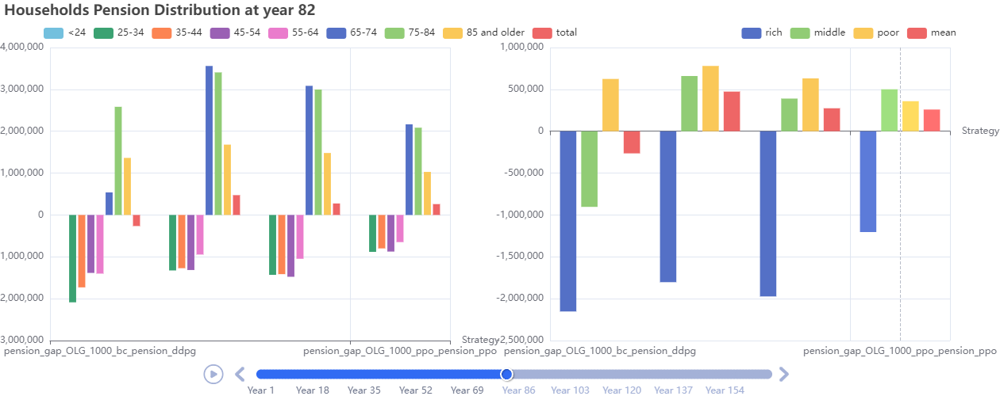
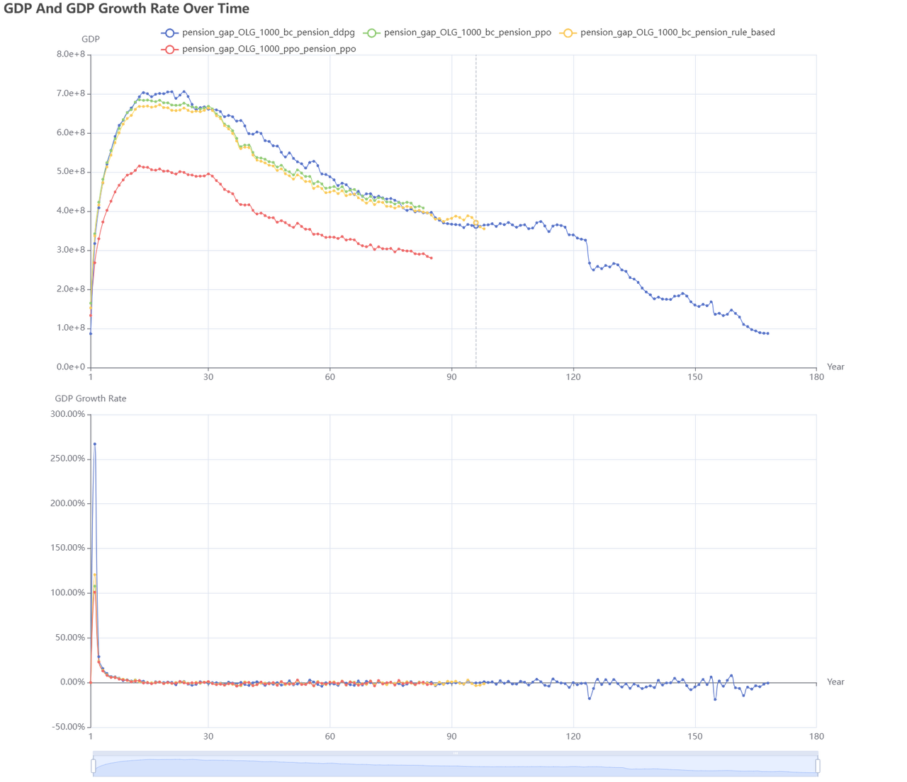

# Q4: How to close pension funding gaps?

## 1. Introduction

### 1.1 Definition of the Pension Gap

The pension gap refers to the shortfall that arises when projected future pension expenditures under the existing system exceed the sum of government revenues and social‐insurance contributions. This issue intensifies amid accelerating population aging and sustained low fertility, directly threatening the sustainability of the social‐security framework.

### 1.2 Causes of the Pension Gap

The main drivers of the pension gap include:

* **Demographic shifts:** A shrinking workforce combined with a growing retired population raises the dependency ratio.
* **Structural pressures:** Under a pay‐as‐you‐go scheme, current contributions cannot support burgeoning future payouts.
* **Fiscal and investment constraints:** Limited growth in tax revenues and low returns on pension‐fund investments hinder gap closure.

### 1.3 Research Questions

Using an economic‐simulation platform, this study examines the effectiveness of various policy tools in addressing the pension gap, specifically:

* **Government strategies:** How do different policy options (delayed retirement, higher contribution rates, optimized pension‐fund investment) affect fiscal sustainability?
* **Household Actions:** How can individuals, through reinforcement learning behaviors that maximize long-term benefits, contribute to reducing the pension gap? Can individual actions work in synergy with policy measures to jointly narrow the gap?
* **Policy‐mix design and evaluation:** How can the government combine policies optimally to reduce the pension gap, and what are the subsequent impacts on economic growth, labor markets, and income distribution?


### 1.4 Research Significance

* **Institutional‐mechanism design:** Assessing how measures such as delayed retirement, contribution‐rate adjustments, and replacement‐rate optimization influence the magnitude of the pension gap.

---

## 2. Selected Economic Roles

As an example, we selected the following roles from the social role classification of the economic simulation platform. These roles align with the core understanding of the issue and are convenient to implement from an experimental perspective:

| Social Role            | Selected Type                         | Role Description                                                                                                                                                                 |
| ------------------------ | --------------------------------------- | ---------------------------------------------------------------------------------------------------------------------------------------------------------------------------------- |
| Individual           | OLG Model   | Use the OLG framework to capture lifecycle differences in contribution, saving, and post-retirement benefit receipt behavior.                                                    |
| Government             | Pension Authority                    | Manage pension revenue and expenditure balance, including collection of social‐insurance contributions, pension disbursements, fiscal subsidies, and government‐bond issuance. |
| Firm                 | Perfect Competiton          | Model how wages and employment rates—driven by labor supply and demand—indirectly affect total pension contributions.                                                          |
| Bank | No-Arbitrage Platform | Simulate pension‐fund investment behavior and how long-term interest‐rate movements impact fund returns and fiscal support capacity.                                           |

---

### Rationale for Selected Roles

**Individual → Overlapping Generations (OLG) Model**  
This study focuses on intergenerational wealth transfers, contribution behaviors, and retirement decisions. The Overlapping Generations (OLG) framework captures how cohorts at different ages respond to the pension system, accurately reflecting household heterogeneity under aging.

**Government → Pension Authority**  
Acting as both system designer and fiscal backer, the Pension Authority must address the pension gap through policy levers such as taxation, bond issuance, and structural reforms.

**Firm → Perfect Competiton**  
Wages and employment are determined by supply and demand and directly affect households’ contribution capacity and retirement savings. Embedding this market mechanism in the experiment is essential.

**Bank → No-Arbitrage Platform**  
Pension‐fund investment returns influence system sustainability. An arbitrage‐free model ensures proper long‐term rate dynamics and fiscal‐return mechanisms.

---

## 3. Selected Agent Algorithms

This section provides a recommended agent configuration. Users are encouraged to adjust agent types based on the specific needs of their experiments.

| Economic Role | Agent Algorithm        | Description                                                  |
| ------------- | ---------------------- | ------------------------------------------------------------ |
| Individual             | Behavior Cloning Agent      | Reproduce real-world lifecycle-based decisions on contributions, savings, and retirement using behavior cloning.                        |
| Government             | Rule-Based Agent / RL Agent | Define rule-based triggers (e.g., bond issuance, tax hikes) in response to pension shortfalls, or employ RL to optimize pension policy. |
| Firm                 | Rule-Based Agent            | Map labor-market responses via supply–demand rules, reflecting wage and employment dynamics.                                           |
| Bank | Rule-Based Agent            | Set investment-return adjustments based on long-term interest rates and demographic shifts using explicit rules.                        |

## **4. Running the Experiment**

### **4.1 Quick Start**

To run the simulation with a specific problem scene, use the following command:

```Bash
python main.py --problem_scene ""
```

This command loads the configuration file `cfg/`, which defines the setup for the "" problem scene. Each problem scene is associated with a YAML file located in the `cfg/` directory. You can modify these YAML files or create your own to define custom tasks.

### **4.2 Problem Scene Configuration**

Each simulation scene has its own parameter file that describes how it differs from the base configuration (`cfg/base_config.yaml`). Given that EconGym contains a vast number of parameters, the scene-specific YAML files only highlight the differences compared to the base configuration. For a complete description of each parameter, please refer to the comments in `cfg/base_config.yaml`.

### **Example ​**​**YAML**​**​ Configuration: ​**

---

## 5.Illustrative Experiments

### Experiment: Optimal Pension Policy Solution

* **Experiment Description:**
  
  Train reinforcement learning models using the minimization of the pension gap as the reward function, and compare the outcomes across different RL algorithms as well as between RL-based policies and baseline scenarios.
* **Experimental Variables:**
  
  * Pension replacement rate
  * GDP impact
* **Baselines:**
  
  We constructed the simulated economic environment using **Individuals modeled as Behavior Cloning (BC) Agents with the OLG framework** and the **​Government modeled as different strategies (​**​​**DDPG**​**, ​**​​**PPO**​​**)**​. The bar charts illustrate household pension distributions under alternative household–government policy combinations:
  
  * **Policy settings (groups of bars):**
    * ​**pension\_gap\_OLG\_1000\_bc\_pension\_ddpg**​: Households are modeled as Behavior Cloning (BC) Agents , using the OLG model with 1000 households, while the government is trained using the DDPG algorithm.
    * ​**pension\_gap\_OLG\_1000\_bc\_pension\_ppo**​: Households are modeled as Behavior Cloning (BC) Agents , using the OLG model with 1000 households, while the government is trained using the PPO algorithm.
    * ​**pension\_gap\_OLG\_1000\_bc\_pension\_rule\_based**​: Households are modeled as Behavior Cloning (BC) Agents , using the OLG model with 1000 households, while the government is implemented as a Rule-Based Agent.
    * ​**pension\_gap\_OLG\_1000\_ppo\_pension\_ppo**​: Households are modeled as RL Agents (PPO) , using the OLG model with 1000 households, and the government is also trained using the PPO algorithm.
  * **Color coding (within each group):**
    * Left panel: Different bar colors represent **age cohorts** (<24, 25–34, 35–44, 45–54, 55–64, 65–74, 75–84, 85+, total).
    * Right panel: Different bar colors represent **wealth classes** (rich, middle, poor, and mean).
* **Visualized Experimental Results：**



**Figure 1:** From the age-based breakdown, the BC\_PPO combination yields the highest total pension surplus. RL-based government strategies significantly reduce pension gaps among young and middle-aged groups, with the PPO\_PPO strategy achieving the smallest pension deficit for young individuals.From the wealth-based breakdown, the BC\_PPO strategy again results in the highest overall pension surplus. The PPO\_PPO combination substantially lowers the pension gap for wealthy households (blue bars).

* **Baselines:**
  
  Below, we provide explanations of the experimental settings corresponding to each line in the visualization to help readers better understand the results.
  
  * ​​**pension\_gap\_OLG\_1000\_bc\_pension\_ddpg**​: Households are modeled as Behavior Cloning (BC) Agents , using the OLG model with 1000 households, while the government is trained using the DDPG algorithm.
  * **pension\_gap\_OLG\_1000\_bc\_pension\_ppo***​: Households are modeled as Behavior Cloning (BC) Agents , using the OLG model with 1000 households, while the government is trained using the PPO algorithm.
  * ​​**pension\_gap\_OLG\_1000\_bc\_pension\_rule\_based**​: Households are modeled as Behavior Cloning (BC) Agents , using the OLG model with 1000 households, while the government is implemented as a Rule-Based Agent.
  * ​**pension\_gap\_OLG\_1000\_ppo\_pension\_ppo**: Households are modeled as RL Agents (PPO) , using the OLG model with 1000 households, and the government is also trained using the PPO algorithm.



**Figure 2:** GDP trajectories under different training strategies. The BC\_DDPG combination achieves both stronger long-term GDP growth and a longer simulation duration, while the PPO\_PPO strategy results in the lowest GDP level.

* Although RL strategies are effective in reducing the pension gap, this optimization may come at the cost of **economic growth—particularly ​**when households also adopt RL-based decision-making. Overall, the combination where households follow Behavior Cloning and the government adopts an RL Agent strikes the best balance between sustained economic development and minimizing the pension gap.


