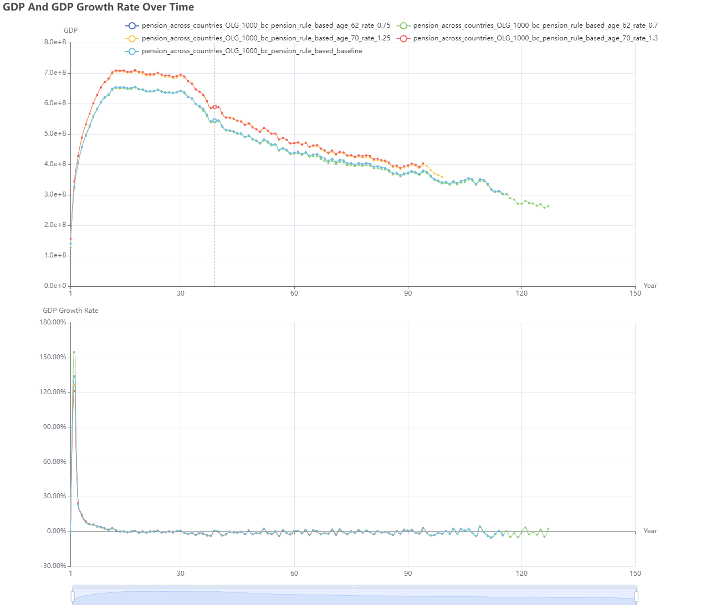

# Q5: How do pension systems vary across countries?

## 1. Introduction

### 1.1 Background

Pension systems vary significantly across countries in their structural design, contribution schemes, retirement ages, and replacement rates. For example, Nordic countries feature high taxes and generous benefits, the United States combines individual accounts with Social Security, and China faces structural challenges under rapid population aging. **Understanding these differences helps evaluate the strengths and weaknesses of system designs and guide domestic reforms.**

### 1.2 Comparative Significance

Pension schemes not only secure elderly livelihoods but also shape national savings rates, labor-force participation, and government fiscal burdens. Cross-country variations reflect differing trade-offs between efficiency and equity in welfare-state models.

### 1.3 Research Questions

Using an economic simulation platform, this study investigates the comparative impacts of pension systems across countries, specifically examining:

* **Retirement Age:** Is the statutory retirement age the key factor through which different pension systems shape long-term economic outcomes?
* **Contribution Levels:** What are the economic consequences of higher or lower contribution rates for both households and government budgets?
* **System Design:** How do different structural models (pay-as-you-go vs. fully funded vs. mixed systems) affect fiscal sustainability and household welfare?

### 1.4 Research Significance

* **​Feasibility of Institutional Transfer:​** Simulating foreign pension policies in a domestic context provides benchmarks and insights for national reform.
* **​Cross-National Comparative Analysis:​** Evaluating different systems on efficiency, fiscal sustainability, and intergenerational fairness offers lessons on design trade-offs and adaptability.

---

## 2. Selected Economic Roles

As an example, we selected the following roles from the social role classification of the economic simulation platform. These roles align with the core understanding of the issue and are convenient to implement from an experimental perspective:

| Social Role | Selected Type       | Role Description                                                                                                       | Observation                                                                                                                                          | Action                                                       | Reward                                               |
| ----------- | ------------------- | --------------------------------------------------------------------------------------------------------------------- | ---------------------------------------------------------------------------------------------------------------------------------------------------- | ------------------------------------------------------------ | ---------------------------------------------------- |
| **Individual**  | OLG Model           | OLG agents are age-specific and capture lifecycle dynamics between working-age (Young) and retired (Old) individuals.  | $o_t^i = (a_t^i, e_t^i,\text{age}_t^i)$<br/>Private: assets, education, age<br/>Global: wealth distribution, education distribution, wage rate, price_level, lending rate, deposit_rate | $a_t^i = (\alpha_t^i, \lambda_t^i, \theta_t^i)$<br>Asset allocation, labor, investment <br/>*OLG*: old agents $\lambda_t^i = 0$    | $r_t^i = U(c_t^i, h_t^i)$ (CRRA utility)   <br/>*OLG includes pension if retired*      |
| **Government**  | Pension Authority   | Pension Authority manages intergenerational transfers by setting retirement age, contribution rates, and pension payouts.  | \$\$o\_t^g = ( F\_{t-1}, N\_{t}, N^{old}\_{t}, \\text{age}^r\_{t-1}, \\tau^p\_{t-1}, B\_{t-1}, Y\_{t-1}) \$\$ <br>Pension fund, current population, old individuals number, last retirement age, last contribution rate, debt, GDP | $a_t^{\text{pension}} = ( \text{age}^r_t, \tau^p_t, k )$<br>Retirement age, contribution rate, growth rate | Pension fund sustainability                                  |
| **Firm**       | Perfect Competition | Perfectly Competitive Firms are price takers with no strategic behavior, ideal for baseline analyses.                 | /                                                                                                                                                    | /                                                            | Zero (long-run)                                      |
| **Bank**       | Non-Profit Platform | Non-Profit Platforms apply a uniform interest rate to deposits and loans, eliminating arbitrage and profit motives.   | /                                                                                                                                                    | No rate control                                              | No profit                                            |

---

### Rationale for Selected Roles

**Individual → Overlapping Generations (OLG) Model**  
Use the Overlapping Generations framework to model life‐cycle differences in retirement, saving, and consumption decisions across countries.

**Government → Pension Authority**  
Implement and manage various pension-system parameters, including contribution rates, replacement rates, and fiscal subsidies.

**Firm → Perfect Competition**  
Reflect how changes in labor‐force participation under different pension regimes dynamically adjust wages and the contribution base through market mechanisms.

**Bank → Non-Profit Platform**  
Simulate investment‐return trajectories under funded pension schemes or capture interest‐rate fluctuations tied to government‐bond–based subsidy mechanisms.

---

## 3. Selected Agent Algorithms

This section provides a recommended agent configuration. Users are encouraged to adjust agent types based on the specific needs of their experiments.

| Economic Role | Agent Algorithm        | Description                                                  |
| ------------- | ---------------------- | ------------------------------------------------------------ |
| Individual             | Behavior Cloning Agent | Reproduce how residents of different countries react behaviorally to pension systems, capturing heterogeneity.        |
| Government             | Rule-Based Agent       | Implement rule-based templates of each country’s pension policies, facilitating comparative experiments.             |
| Firm                 | Rule-Based Agent       | Adjust wages via supply–demand rules, supporting market responses under varying demographic structures.              |
| Bank | Rule-Based Agent       | Feedback pension-fund asset changes or fiscal pressure through macro-level rules governing interest and return rates. |

---

## 4. Running the Experiment

### 4.1 Quick Start

To run the simulation with a specific problem scene, use the following command:

```bash
python main.py --problem_scene "pension_across_countries"
```

This command loads the configuration file `cfg/pension_across_countries.yaml`, which defines the setup for the "pension_across_countries" problem scene. Each problem scene is associated with a YAML file located in the `cfg/` directory. You can modify these YAML files or create your own to define custom tasks.

### 4.2 Problem Scene Configuration

Each simulation scene has its own parameter file that describes how it differs from the base configuration (`cfg/base_config.yaml`). Given that EconGym contains a vast number of parameters, the scene-specific YAML files only highlight the differences compared to the base configuration. For a complete description of each parameter, please refer to the comments in `cfg/base_config.yaml`.

### Example YAML Configuration: `pension_across_countries.yaml`

```yaml
Environment:
  env_core:
    problem_scene: "pension_across_countries"
    estate_tax_rate: 0.0
    estate_tax_exemption: 13610000
    episode_length: 300
  Entities:
    - entity_name: 'government'
      entity_args:
        params:
          type: "pension"  # Focus on pension policy. type_list: ['tax', 'pension', 'central_bank']
          retire_age: 62
          pension_rate: 0.7
          contribution_rate: 0.08
          gov_task: "gdp"


    - entity_name: 'households'
      entity_args:
        params:
          type: 'OLG'

          households_n: 1000
        OLG:
          birth_rate: 0.011
          initial_working_age: 24
    - entity_name: 'market'
      entity_args:
        params:
          type: "perfect"

    - entity_name: 'bank'
      entity_args:
        params:
          type: 'non_profit'
          n: 1
          lending_rate: 0.0345
          deposit_rate: 0.0345
          reserve_ratio: 0.1
          base_interest_rate: 0.0345
          depreciation_rate: 0.06

Trainer:
  house_alg: "bc"
  gov_alg: "rule_based"
  firm_alg: "rule_based"
  bank_alg: "rule_based"
  seed: 1
  p_lr: 1e-4
  epoch_length: 300
  cuda: False
#  n_epochs: 1000
  test: False
```

---

## ​**5. Illustrative Experiments**

### Experiment: Parametric Adjustment of a Specific Country's Pension System

* **Experiment Description:**
  
  Using the predefined U.S. pension system in the model as the baseline, we introduce slight policy adjustments regarding early and delayed retirement—for example, reducing pension benefits by 25%–30% for early retirees, and increasing benefits by 25%–30% for those who delay retirement.
* **Experimental Variables:**
  
  * Pension benefit adjustments for early and delayed retirement
  * GDP level of the simulated economy
* **Baselines:**
  
  Below, we provide explanations of the experimental settings corresponding to each line in the visualization to help readers better understand the results.
  
  * **pension\_across\_countries\_OLG\_1000\_bc\_pension\_rule\_based\_age\_62\_rate\_0.75 (Blue line):** Households are modeled as **Behavior Cloning Agents with the OLG framework**, and the government is modeled as a **Rule-Based Agent**. Retirement age is 62, with pension benefits **reduced by 25%**.
  * **pension\_across\_countries\_OLG\_1000\_bc\_pension\_rule\_based\_age\_62\_rate\_0.7 (Green line):** Households are modeled as **Behavior Cloning Agents with the OLG framework**, and the government is modeled as a **Rule-Based Agent**. Retirement age is 62, with pension benefits **reduced by 30%**.
  * **pension\_across\_countries\_OLG\_1000\_bc\_pension\_rule\_based\_age\_70\_rate\_1.25 (Yellow line):** Households are modeled as **Behavior Cloning Agents with the OLG framework**, and the government is modeled as a **Rule-Based Agent**. Retirement age is 70, with pension benefits **increased by 25%**.
  * **pension\_across\_countries\_OLG\_1000\_bc\_pension\_rule\_based\_age\_70\_rate\_1.3 (Red line):** Households are modeled as **Behavior Cloning Agents with the OLG framework**, and the government is modeled as a **Rule-Based Agent**. Retirement age is 70, with pension benefits **increased by 30%**.
  * **pension\_across\_countries\_OLG\_1000\_bc\_pension\_rule\_based\_baseline (Light Blue line):** Households are modeled as **Behavior Cloning Agents with the OLG framework**, and the government is modeled as a **Rule-Based Agent**. This baseline follows the predefined U.S. pension system with **standard retirement rules**.
* **Visualized Experimental Results：**



**Figure 1: ​**Long-Term GDP Comparison Under Different Pension Policies Using the current U.S. pension system as the baseline, adjusting the "pension penalty" for early retirement has little impact on GDP growth. However, increasing the "additional pension benefits" for delayed retirement leads to significantly higher long-term GDP levels.

* Compared to imposing "penalties" for early retirement, **offering incentives for voluntary delayed retirement ​**more effectively enhances overall economic stability and vitality, and contributes to higher aggregate GDP in the long run.


